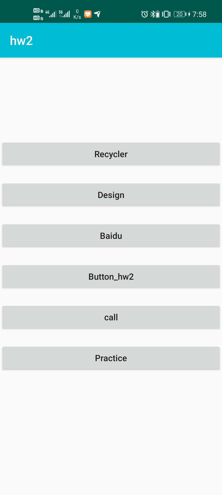

# Android_zju_summer
浙大小学期安卓开发课程

## 作业2

**源代码在hw2中**

本次作业主页面有六个按键如下：

+ 第一个按钮跳转的是Recycler的一个界面
+ 第二个是一个页面的设计，使用了PagerView实现了一个图片的左右翻页的功能，下面的按钮用于返回主界面。
+ 第三个用于跳转到百度
+ 第四个是Toast的弹框
+ 第五个是电话界面，默认会输入本人的手机号码
+ 第六个是一个简单的页面跳转，跳转过去后有一个按钮用于返回

