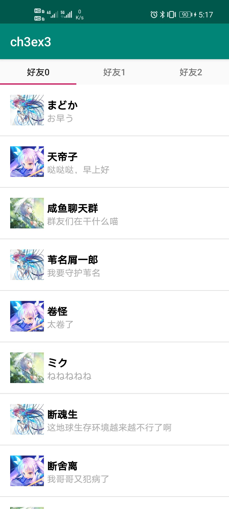

# chapter-3

《UI开发进阶：Fragment & Animation》

> 2021年浙大《安卓应用开发技术》课程第三讲

## 我的提交

代码在Ch3分支的Homework中

## 说明

第三章作业的说明

+ 在基于给出空图的基础上补齐了所需要补齐的TODO
+ 自己设计了好友列表的Fragment并且修改了原始的CH3EX3的布局为Linear（图片只放了三张所以出现了复用

